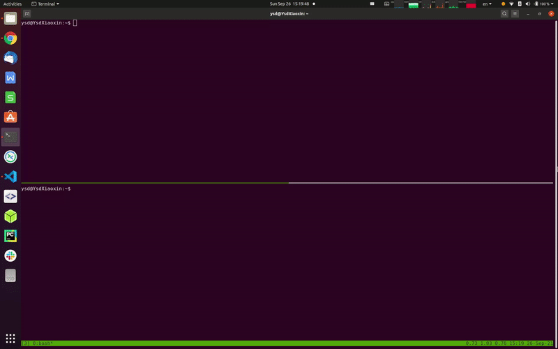

# modpoll - A New Command Line Tool for Modbus

[](https://gitlab.com/helloysd/modpoll/-/commits/master)
[](https://gitlab.com/helloysd/modpoll/-/blob/master/LICENSE)
[](http://pepy.tech/project/modpoll)

> Learn more about *modpoll* usage at [documentation](https://helloysd.gitlab.io/modpoll) site. 


## Motivation

The initial idea of creating this tool is to help myself debugging new devices during site survey. A site survey usually has limited time and space, working on-site also piles up some pressures. At that time, a portable swiss-knife toolkit is our best friend.

This program can be easily deployed to Raspberry Pi or similar embedded devices, polling data from modbus devices, users can choose to log data locally or publish to a MQTT broker for further debugging. 

The MQTT broker can be setup on the same Raspberry Pi or on the cloud. Once data successfully published, users can subscribe to a specific MQTT topic to view the data via a smart phone at your fingertip. 


<p align="center">
  
</p>


Moreover, you can also run this program continuously on a server as a Modbus-MQTT gateway, i.e. polling from local Modbus devices and forwarding data to a centralized cloud service. 

In fact, *modpoll* helps to bridge between the traditional fieldbus world and the new IoT world. 


> This program is designed to be a standalone tool, it works out-of-the-box on Linux/macOS/Windows. 

> If you are looing for a modbus python library, please consider the following great open source projects, [pymodbus](https://github.com/riptideio/pymodbus) or [minimalmodbus](https://github.com/pyhys/minimalmodbus)


## Feature

- Support Modbus RTU/TCP/UDP devices
- Show polling data for local debugging, like a typical modpoll tool
- Publish polling data to MQTT broker for remote debugging, especially on smart phone
- Export polling data to local storage for further investigation
- Provide docker solution for continuous data polling use case


## Installation

This program is tested on python 3.6+, the package is available in the Python Package Index, users can easily install it using `pip` or `pipx`.

### Using PIP

Python3 is supported by most popular platforms, e.g. Linux/macOS/Windows, on which you can install *modpoll* using `pip` tool, 

```bash
pip install modpoll
```

Upgrade the tool via the following command,

```bash
pip install -U modpoll
```

### On Windows

It is recommended to use `pipx` for installing *modpoll* on Windows, refer to [here](https://pypa.github.io/pipx/installation/) for more information about `pipx`. 

Once `pipx` installed, you can run the following command in a Command Prompt termial. 

```PowerShell
pipx install modpoll
```

Upgrade the tool via the following command,

```PowerShell
pipx upgrade modpoll
```


## Quickstart

As the name tells, *modpoll* is a tool for communicating with Modbus devices, so ideally it makes more sense if you have a real Modbus device on hand for the following test, but it is OK if you don't, we provide a virtual Modbus TCP device deployed at `modsim.topmaker.net:502` for your quick testing purpose. 

Let's start expoloring *modpoll* with *modsim* device.

> the modsim code is also available [here](https://github.com/gavinying/modsim)


### Prepare Modbus configure file

Before running *modpoll* tool, we need to prepare a Modbus configuration file, which describes the polling pattern and device's register map according to vendor's documents. 

The configuration can be either a local file or a remote URL resource. 

For the *modsim* device, we will use the following [configuration file](https://raw.githubusercontent.com/gavinying/modpoll/master/examples/modsim.csv) as an example. 


```CSV
device,modsim001,1
poll,holding_register,40001,5,BE_BE
ref,register1,40001,uint16,rw,
ref,register2,40002,uint16,rw,
ref,register3,40003,uint16,rw,
ref,register4,40004,uint16,rw,
ref,register5,40005,uint16,rw,
device,modsim002,2
poll,coil,1,4,BE_BE
ref,coil1-8,1,bool,rw,
ref,coil9-16,2,bool,rw,
ref,coil17-24,3,bool,rw,
ref,coil25-32,4,bool,rw,
```

This configuration tells *modpoll* to do the following for each poll,

- Read the first 5 holding registers from device `modsim001` (address = `1`) 
- Read the first 32 coils from device `modsim002` (address = `2`)


### Poll online device (modsim)

Run the following command in a terminal, 

```bash
modpoll --tcp modsim.topmaker.net --config https://raw.githubusercontent.com/gavinying/modpoll/master/examples/modsim.csv
```


<p align="center">
  
</p>


### Poll local device (modsim)

If you prefer a local test or behind a company firewall, you can launch your own device simulator by running `modsim` locally, 

```bash
docker run -p 5020:5020 helloysd/modsim
```

> Use `sudo` before the docker command if you want to use the standard port `502`.

It will create a virtual Modbus TCP device running at `localhost:5020`, and then you can poll it using *modpoll* tool, 

```bash
modpoll --tcp localhost --tcp-port 5020 --config https://raw.githubusercontent.com/gavinying/modpoll/master/examples/modsim.csv
```


### Publish data to MQTT broker

This is a useful function of this new *modpoll* tool, which provides a simple way to publish collected modbus data to MQTT broker, so users can view data from a smart phone via a MQTT client. 

The following example uses a public MQTT broker `mqtt.eclipseprojects.io` for test purpose. You can also setup your own MQTT broker locally using [mosquitto](https://mosquitto.org/download/).

```bash
modpoll --tcp modsim.topmaker.net --config https://raw.githubusercontent.com/gavinying/modpoll/master/examples/modsim.csv --mqtt-host mqtt.eclipseprojects.io
```

With successful data polling and publishing, you can subscribe the topic `modpoll/modsim` on the same MQTT broker `mqtt.eclipseprojects.io` to view the collected data. 

> The MQTT topic uses `<mqtt_topic_prefix>/<deviceid>` pattern, <mqtt_topic_prefix> is provided by `--mqtt-topic-prefix` argument, the default value is `modpoll/`  and <deviceid> is provided by the Modbus configure file. 


<p align="center">
  
</p>


### Write registers via MQTT publish

The *modpoll* tool will subscribe to the topic `<mqtt_topic_prefix>/<deviceid>/set` once it successfully connected to MQTT broker, user can write device register(s) via MQTT publish, 

- To write a single holding register (address at `40001`)

  ```json
  {
    "object_type": "holding_register",
    "address": 40001,
    "value": 12
  }
  ```

- To write multiple holding registers (address starting from `40001`)

  ```json
  {
    "object_type": "holding_register",
    "address": 40001,
    "value": [12, 13, 14, 15]
  }
  ```


## Run in docker

A docker image has been provided for user to directly run the program without local installation, 

  ```bash
  docker run helloysd/modpoll
  ```

It shows the version of the program by default.

Similar to the above `modsim` test, we can poll the first 5 holding registers with `docker run`,

  ```bash
  docker run helloysd/modpoll modpoll --tcp modsim.topmaker.net --config https://raw.githubusercontent.com/gavinying/modpoll/master/examples/modsim.csv
  ```

If you want to load a local configure file, you need to mount a local folder onto container volume, 
for example, if the child folder `examples` contains the config file `modsim.csv`, we can use it via the following command, 

  ```bash
  docker run -v $(pwd)/examples:/app/examples helloysd/modpoll modpoll --tcp modsim.topmaker.net --config /app/examples/modsim.csv
  ```


## Basic Usage

- Connect to Modbus TCP device

  ```bash
  modpoll --tcp 192.168.1.10 --config examples/modsim.csv
  ```

- Connect to Modbus RTU device 

  ```bash
  modpoll --rtu /dev/ttyUSB0 --rtu-baud 9600 --config examples/scpms6.csv
  ```

- Connect to Modbus TCP device and publish data to MQTT broker 

  ```bash
  modpoll --tcp modsim.topmaker.net --tcp-port 5020 --config examples/modsim.csv --mqtt-host mqtt.eclipseprojects.io
  ```

- Connect to Modbus TCP device and export data to local csv file

  ```bash
  modpoll --tcp modsim.topmaker.net --tcp-port 5020 --config examples/modsim.csv --export data.csv
  ```


> *Please refer to the [documentation](https://helloysd.gitlab.io/modpoll) site for more details about the configuration and examples.*


## Credits

The implementation of this project is heavily inspired by the following two projects:
- https://github.com/owagner/modbus2mqtt (MIT license)
- https://github.com/mbs38/spicierModbus2mqtt (MIT license)

Thanks to Max Brueggemann and Oliver Wagner for their great work. 


## License

MIT © [helloysd](helloysd@foxmail.com)
