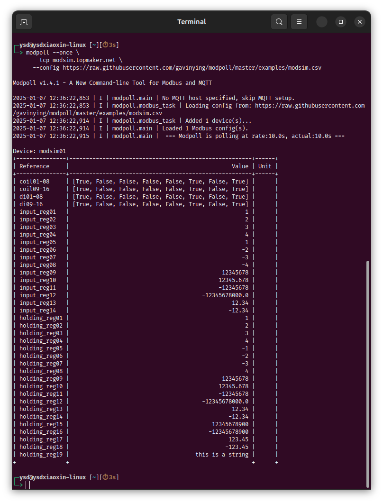

# ModPoll - A new modpoll tool for modbus communication

[](https://gitlab.com/helloysd/modpoll/-/commits/master)
[](https://gitlab.com/helloysd/modpoll/-/blob/master/LICENSE)
[](http://pepy.tech/project/modpoll)

> Learn more about `modpoll` usage at [documentation](https://helloysd.gitlab.io/modpoll) site. 

## Motivation

The initial idea of creating this tool is to help myself debugging new devices during site survey. A site survey usually has limited time and space, working on-site also piles up some pressures. At that time, a portable swiss-knife toolkit is our best friend.

This program can be easily deployed to Raspberry Pi or similar embedded devices, continuously polling data from the connected modbus devices, user can choose to save data locally or publish to a MQTT broker for easy debugging, the MQTT broker can be setup on the same Raspberry Pi or on the cloud. Once data has been successfully published, user can subscribe to a specific MQTT topic to view the collected data via a smart phone. 


Moreover, you can also continuously run this program on any PC or server with Python 3 support. One common use case is to deploy `modpoll` onto a server and keep it running as a gateway, i.e. polling data from local Modbus devices and forward to a centralized cloud server. In that sense, `modpoll` helps to bridge between the traditional world of fieldbus network and the modern world of IoT edge/cloud infrustructure. 

> This program is designed to be a standalone tool, it works out-of-the-box. If you are looing for a modbus python library, please consider the following two great open source projects, [pymodbus](https://github.com/riptideio/pymodbus) or [minimalmodbus](https://github.com/pyhys/minimalmodbus)


## Installation

This program is tested on python 3.6+, the package is available in the Python Package Index, user can easily install it using `pip`.

```bash
pip install modpoll
```

Upgrade the tool via the following command,

```bash
pip install -U modpoll
```


## Quickstart

As the name tells, *modpoll* is a tool for communicating with Modbus devices, so ideally it makes more sense if you have a real Modbus device on hand for the following test, but it is OK if you don't, we have deployed a virtual Modbus TCP device on cloud at `modsim.topmaker.net:502` for your quick testing purpose, the code is available at [modsim](https://github.com/gavinying/modsim), let's start expoloring *modpoll* tool with the virtual device *modsim*.

### Poll modsim service

Using *modpoll* tool, you can poll the first 5 holding registers via the following command,

```bash
modpoll --tcp modsim.topmaker.net --config https://raw.githubusercontent.com/gavinying/modpoll/master/examples/modsim.csv
```




### Poll local modsim

If you prefer a local test, you can launch your own device simulator by running `modsim` locally, 

```bash
docker run -p 5020:5020 helloysd/modsim
```

> Use `sudo` before the docker command if you want to use the standard port `502`.

It will create a virtual Modbus TCP device running at `localhost:5020`, and then you can poll it using `modpoll` tool, 

```bash
modpoll --tcp localhost --tcp-port 5020 --config https://raw.githubusercontent.com/gavinying/modpoll/master/examples/modsim.csv
```


### Publish data to MQTT broker

This is the most useful function of this new *modpoll* tool. `modpoll` provides a very simple way to publish collected data to MQTT broker, so user can view data from a smart phone via any free MQTT client app. 

The following example uses a public MQTT broker `mqtt.eclipseprojects.io` for test purpose. You can also setup your own MQTT broker locally using [mosquitto](https://mosquitto.org/download/).

```bash
modpoll --tcp modsim.topmaker.net --config https://raw.githubusercontent.com/gavinying/modpoll/master/examples/modsim.csv --mqtt-host mqtt.eclipseprojects.io
```

With successful data polling and publishing, you can subscribe the topic `modpoll/modsim` on the same MQTT broker `mqtt.eclipseprojects.io` to view the collected data. 

> The MQTT topic uses `<mqtt_topic_prefix>/<deviceid>` pattern, <mqtt_topic_prefix> is provided by `--mqtt-topic-prefix` argument, the default value is `modpoll/`  and <deviceid> is provided by the Modbus configure file. 


## Run in docker

A docker image has been provided for user to directly run the program without local installation, 

  ```bash
  docker run helloysd/modpoll
  ```

It shows the version of the program by default.

Similar to the above `modsim` test, we can poll the first 5 holding registers with `docker run`,

  ```bash
  docker run helloysd/modpoll --tcp modsim.topmaker.net --config https://raw.githubusercontent.com/gavinying/modpoll/master/examples/modsim.csv
  ```

If you want to load a local configure file, you need to mount a local folder onto container volume, 
for example, if the child folder `examples` contains the config file `modsim.csv`, we can use it via the following command, 

  ```bash
  docker run -v $(pwd)/examples:/app/examples helloysd/modpoll --tcp modsim.topmaker.net --config /app/examples/modsim.csv
  ```


## Basic Usage

- Connect to Modbus TCP device

  ```bash
  modpoll --tcp 192.168.1.10 --config examples/modsim.csv

  ```

- Connect to Modbus RTU device 

  ```bash
  modpoll --rtu /dev/ttyUSB0 --rtu-baud 9600 --config examples/scpms6.csv

  ```

- Connect to Modbus TCP device and publish data to MQTT broker 

  ```bash
  modpoll --tcp modsim.topmaker.net --tcp-port 5020 --config examples/modsim.csv --mqtt-host mqtt.eclipseprojects.io

  ```

- Connect to Modbus TCP device and export data to local csv file

  ```bash
  modpoll --tcp modsim.topmaker.net --tcp-port 5020 --config examples/modsim.csv --export data.csv
  
  ```


> *Please refer to the [documentation](https://helloysd.gitlab.io/modpoll) site for more details about the configuration and examples.*


## Credits

The implementation of this project is heavily inspired by the following two projects:
- https://github.com/owagner/modbus2mqtt (MIT license)
- https://github.com/mbs38/spicierModbus2mqtt (MIT license)

Thanks to Max Brueggemann and Oliver Wagner for their great work. 


## License

MIT © [helloysd](helloysd@foxmail.com)
